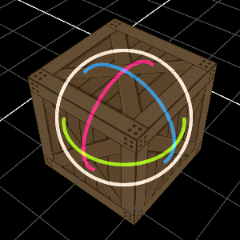
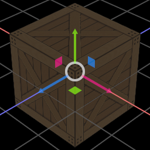
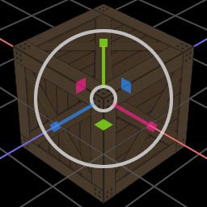

# egui-gizmo

[](https://crates.io/crates/egui-gizmo)
[](https://docs.rs/egui-gizmo)


3d transformation gizmo built on top of the [egui](https://github.com/emilk/egui) library.

[Try it out in a web demo](https://urholaukkarinen.github.io/egui-gizmo/)





## Usage

```rust 
let gizmo = Gizmo::new("My gizmo")
    .view_matrix(view_matrix)
    .projection_matrix(projection_matrix)
    .model_matrix(model_matrix)
    .mode(GizmoMode::Rotate);

if let Some(response) = gizmo.interact(ui) {
    model_matrix = response.transform.into();
}
```

For a more complete example, see the [demo source code](demo/src/main.rs).

The gizmo accepts matrices as `Into<[[f32; 4]; 4]>`, which means it is easy to use with matrix types from various crates
such as [nalgebra](https://github.com/dimforge/nalgebra), [glam](https://github.com/bitshifter/glam-rs)
and [cgmath](https://github.com/rustgd/cgmath).