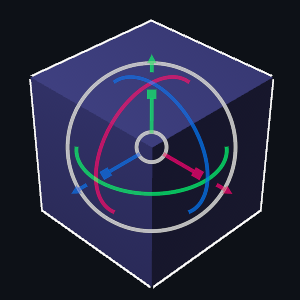

# transform-gizmo

`transform-gizmo` is a framework-agnostic Rust crate that provides a feature-rich and customizable 3D transformation gizmo for manipulating the position, rotation and scale of 3D entities.

[Try it out in a web demo](https://urholaukkarinen.github.io/transform-gizmo/)

## Usage

### Bevy

[`transform-gizmo-bevy`](https://docs.rs/transform-gizmo-bevy) provides a Plugin for easy integration into the [Bevy Engine](https://bevyengine.org/).

### Egui

[`transform-gizmo-egui`](https://docs.rs/transform-gizmo-egui) enables you to use the Gizmo wherever [Egui](https://github.com/emilk/egui) is used.

### Other

For interacting with the gizmo, all you will need to do is give `Gizmo::update` sufficient
information about user interaction, in the form of `GizmoInteraction`.

For rendering the gizmo, `Gizmo::draw` provides vertices in viewport coordinates that can be easily rendered
with your favorite graphics APIs.

## Other

The gizmo exposes mathematical types as [mint](https://github.com/kvark/mint) types, which means it is easy to use with types from various crates
such as [nalgebra](https://github.com/dimforge/nalgebra), [glam](https://github.com/bitshifter/glam-rs)
and [cgmath](https://github.com/rustgd/cgmath). You may need to enable a `mint` feature, depending on the math library.

## License

This crate is dual licensed under MIT and Apache 2.0.

## Contributing

Contributions are welcome! See [CONTRIBUTING.md](CONTRIBUTING.md)